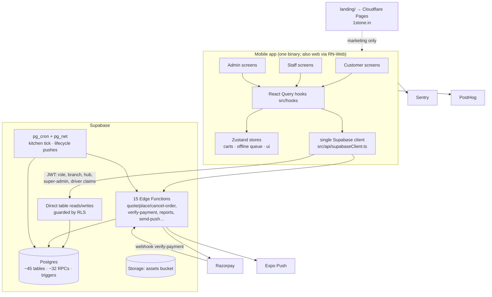

# 1stOne — Codebase Map (Onboarding Synthesis)

> **Provenance.** Written 2026-07-21 from a direct read of the source tree at `fc8b79a` (HEAD). Verified fact: **no application or server code has changed since commit `f618c60`** — only docs and the `landing/` site — so the code-derived doc set (`docs/03`–`06`) still describes the current code exactly. This document is the newcomer's map: it synthesizes those docs, verifies them against source, traces the key journeys with `file:line` citations, and flags every doc/code discrepancy found. Inferences are labeled *(inference)*.

---

## 1. Business purpose

1stOne is a home-kitchen food business app (Siddapur, Uttara Kannada, Karnataka — single region, `Asia/Kolkata`). It sells **fresh meals and household essentials on fixed daily delivery cycles**, as one-off orders or **prepaid subscriptions**, with last-mile delivery either **direct** (zone driver) or via **hubs** (driver → hub operator handoff).

One app, one phone-OTP login, four personas routed by JWT claims:

| Persona | Surface |
|---|---|
| **Customer** | storefront, cart/checkout, wallet, subscriptions, referrals, loyalty, feedback |
| **Staff** (kitchen/packing) | the batch board, attendance (offline-capable), supply requests, expense claims |
| **Driver / hub operator** | Driver Dashboard / Hub Dashboard (flavours of customer/staff roles) |
| **Admin / super-admin** | Reports + the entire "Manage" console; nearly every business rule is DB-config, not code |

The design center: **the server decides money, dates, and prices; the phone only sends intent.** Everything else follows from that.

## 2. Architecture

- **Client:** Expo SDK 54 / React Native 0.81.5 / React 19.1, TypeScript, Hermes. Runs on Android, iOS, and web (React Native Web; web checkout is wallet-only because the Razorpay SDK is native-only). OTA updates via `expo-updates` (`ON_LOAD`, `runtimeVersion: sdkVersion`).
- **State:** TanStack Query (server cache, keys in `src/utils/constants.ts`), Zustand (`src/store/`: two carts, staff offline queue, UI, admin branch filter).
- **Backend:** Supabase — Postgres (~45 tables, ~32 `SECURITY DEFINER` RPCs, RLS on every table), 15 Deno edge functions (`supabase/functions/`), `pg_cron` + `pg_net` for scheduled jobs, Storage for images/PDFs, Auth (phone OTP) with a custom access-token hook stamping role claims into the JWT.
- **Third parties:** Razorpay (payments + HMAC-verified webhook), Expo Push, Google Maps, Sentry, PostHog, Cloudflare Pages (`landing/` marketing site — see `landing/_headers:1`).
- **Sync vs async:** all client↔server calls are synchronous HTTPS (PostgREST + edge functions). Async work lives server-side in `pg_cron` (per-minute kitchen tick, daily/weekly lifecycle pushes) and fire-and-forget push fan-out (`EdgeRuntime.waitUntil`). Supabase Realtime streams order changes to staff/admin dashboards (`useRealtimeOrders`).

## 3. Data model (source of truth & caveats)

Full table-by-table detail: `docs/03-architecture-and-data-model.md` §6. The shape in one paragraph:

- **Identity/money:** `profiles` (one row per person; role, branch, wallet balance, loyalty, HR fields), `wallet_transactions` (immutable ledger — app can read, **never write**; RLS `wallet_tx_no_writes`), `pending_wallet_topups`, `loyalty_redemptions`.
- **Catalog:** `menu_items`, `essentials_catalog`, `subscription_plans` (live path reads the `plan_items` JSON; `subscription_plan_items` is legacy), all cycle-tagged, prices **GST-inclusive** (T1 model).
- **Orders:** `orders` = one row **per delivery cycle**; the customer-facing order is the `order_group_id` set. `order_items`, `user_subscriptions` (`days_consumed` drives end-of-life), `cancelled_subscription_days` (skips).
- **Delivery network:** `delivery_cycles` (cutoff / kitchen-push / delivery-start times), `delivery_zones` & `delivery_hubs` (GeoJSON polygons, drivers, fee overrides), `customer_addresses` (serviceability resolved server-side).
- **Ops/system:** `store_config` (single business-rules row), `feature_flags`, `app_config` (URL + service key for in-DB HTTP), `idempotency_keys`, `kitchen_push_log` (the active-batch marker), `manifest_run_log`, `push_logs`, `notification_templates`.

**Caveats:**
- No DB enums — statuses are plain text (`src/utils/orderStatus.ts` is the single vocabulary).
- **The live database is the source of truth over `supabase/sql/schema.sql`** — the snapshot was last refreshed 2026-05-20 via an appended additions block; several RPCs post-date the generated types and are called with casts (the "MF-08 pattern", e.g. `src/hooks/useStaffOrders.ts:179`). Run `npm run supabase:gen-types` after schema changes.
- Migrations = idempotent files in `supabase/sql/` applied manually in the order given by `supabase/sql/DEPLOY_SQL_ORDER.md`. There is no migration runner.
- Caching is client-side only (React Query, 2-min stale time); no server cache layer.

## 4. Request lifecycle — five journeys, traced

### 4.1 Login → role routing
1. Splash held until session check (`App.tsx:45`, watchdog `App.tsx:70-79`); provider stack `App.tsx:92-104`.
2. `LoginScreen` auto-sends OTP / auto-verifies → `useAuth.signInWithPhone` / `verifyOTP` (`src/hooks/useAuth.ts:151-164`) → `supabase.auth.verifyOtp`.
3. The DB hook `custom_access_token_hook` (`supabase/sql/custom_access_token_hook.sql`) stamps `user_role`, `branch_id`, `assigned_hub_id`, `is_super_admin`, `is_driver` into the JWT; the client decodes them with **zero extra queries** in `extractRole` (`src/hooks/useAuth.ts:36-81`).
4. `RootNavigator` mounts the role navigator (`src/navigation/RootNavigator.tsx:141-152`); driver-staff route to `CustomerNavigator` while keeping staff RLS rights (`RootNavigator.tsx:142`). New users go to `OnboardingScreen` (`RootNavigator.tsx:116-135`), which saves profile + first address atomically (`complete_onboarding_atomic`).
5. Claims refresh on app foreground (`useAuth.ts:124-131`) so promotions appear without logout. Realtime auth is kept in lockstep (`useAuth.ts:111-116`).

### 4.2 Place order (the money path)
1. `CheckoutScreen` holds one idempotency key per checkout session (`src/screens/customer/CheckoutScreen.tsx:104`), gets a binding quote (`quote-order` → shared builder), asks Scenario-C consent (`CheckoutScreen.tsx:210`), then calls `place-order` echoing the quote + `Idempotency-Key` header (`CheckoutScreen.tsx:236`).
2. `supabase/functions/place-order/index.ts`: auth (`:76`), rate limit 5/60s (`:82-91`), idempotency replay (`:94-102`), legacy-payload guard (`:117-119`), `client_quote` required → 409 (`:129-132`).
3. Server re-derives everything via `buildAuthoritativeOrder` (`supabase/functions/_shared/orderBuild.ts:109`) — re-prices from DB, groups by cycle, derives IST dispatch dates (`_shared/dispatch.ts:83-99`), carves GST out of inclusive prices, fee priority hub→zone→default.
4. **Drift tripwire:** integer-paise tuple comparison (`place-order/index.ts:157-170`, `driftedFields` at `_shared/dispatch.ts:128-152`). Any drift → 409 `quote_changed`, no money moved; the app re-quotes transparently (`CheckoutScreen.tsx:259`).
5. Payment: Razorpay order created **before** any DB write (`place-order/index.ts:177-197`, status `Pending`) or atomic wallet debit (`:201-209`, status `Confirmed`).
6. All rows written in one transaction — `place_order_atomic` (`:223-235`); on failure the wallet debit auto-refunds, and a failed refund returns a support reference + structured alert (`:239-265`). Wallet debit tagged to the order (`:279-287`); `user_subscriptions` created per plan (`:289-311`) with admin-push reconciliation on failure (`:317-345`). Idempotency key consumed **only on success** (`:361-368`).

### 4.3 Razorpay confirmation (two independent, idempotent paths)
- **Foreground:** app calls `confirm-order`, which verifies the payment signature and marks paid (retried twice by the app).
- **Webhook:** `supabase/functions/verify-payment/index.ts` — HMAC-SHA256 verification, **refuses to run without the secret** (`:59-62`); one `razorpay_order_id` may map to an order *and* a top-up *and* subscriptions, so all three branches run idempotently; `payment.failed` marks failure and notifies.
- Recovery: killed-app mid-payment leaves the order `Pending`; the home screen shows a recovery banner (`usePendingRazorpayOrder`).

### 4.4 Subscription dispatch → the staff batch board
1. `pg_cron` runs `trigger_kitchen_cutoff_pushes()` **every minute** (`supabase/sql/kitchen_cutoff_push.sql`); per cycle past its `kitchen_push_time` and not yet pushed (dedupe: `kitchen_push_log` UNIQUE `(cycle_id, push_date)`, `kitchen_cutoff_push.sql:27-37`).
2. It first runs `generate_daily_manifest` (`supabase/sql/generate_daily_manifest.sql`): one `Confirmed` order per active, non-paused subscription, items mirrored from `plan_items` JSON, **zero-money rows** (BF-19 — revenue was booked at purchase), idempotent per `(subscription, date)`, per-subscription error isolation, logged to `manifest_run_log`.
3. Then `push_kitchen_summary` aggregates and pushes to staff via `pg_net` → `send-push`.
4. The push **is** the batch release: `useActiveStaffBatch` reads the latest `kitchen_push_log` row; `useStaffOrders` shows exactly that cycle's batch **plus** any past-dated undelivered order (`src/hooks/useStaffOrders.ts:52-79`), hub-operator-filtered (`:94-98`), subscription-purchase revenue rows filtered out (`:92`, `isOperationalOrder`). Kitchen tab shows the server-side ingredient aggregation (`get_kitchen_aggregate`, `useStaffOrders.ts:172-185`); bulk advance is one RPC (`:192-211`), and only `Ready` notifies customers.

### 4.5 Staff offline status update
1. `useUpdateOrderStatus` checks connectivity; offline → enqueue into the persisted Zustand queue (`src/hooks/useStaffOrders.ts:124-149`).
2. On reconnect `useOfflineSync` drains FIFO (`src/hooks/useOfflineSync.ts:31-118`) with three guards: session must exist (`:39-40`), **identity guard** — mutations queued by another user on a shared device are discarded (`:53-56`), **no-regress guard** — a status update only applies while the row is at an earlier status (`:73-80`), and the customer push fires only if the update actually landed (`:97-110`). Max 5 retries (`MAX_QUEUE_RETRIES`).

## 5. Auth & permissions

- **Phone OTP only** (Supabase Auth); no passwords. Phone change is OTP-verified and mirrored to `profiles.phone_number` by a trigger (`useAuth.ts:166-184`).
- **JWT custom claims** (§4.1) are read by both the app and the DB. RLS helper functions (`supabase/sql/rls_policies.sql`): `jwt_user_role()`, `jwt_branch_id()`, `is_admin()`, `is_staff_or_admin()`, `is_super_admin()` (falls back to the `profiles` column for stale tokens), `has_branch_access()`.
- **Pattern:** customers touch only their own rows; staff/admin are branch-scoped; super-admin sees all. Sensitive columns (`role`, `wallet_balance`, `loyalty_points`, salary, referral) are writable **only** via SECURITY DEFINER RPCs or service-role edge functions.
- **Persona-gated delivery:** `nextDeliveryStatus(current, method, persona)` (`src/utils/deliveryStatus.ts`) — driver on hub method stops at `Received at Hub`; hub operator takes it to `Delivered`; admin can do the full flow. (Sequencing convention: the driver marks "Received at Hub" first; the hub operator acts only after.)
- **Multi-branch is built but launch-gated:** `branch_management_active` OFF = permissive single-branch mode; ON = strict isolation (needs a `branch_id` backfill + token refresh).
- Edge functions deploy with `--no-verify-jwt` and authenticate callers themselves (`_shared/auth.ts`); `verify-payment` authenticates via webhook HMAC instead.

## 6. Config, secrets, environments, feature flags

- **Runtime business config (no deploy):** `store_config` (tax %, delivery fee, wallet min/max, cancellation window, loyalty rate, storm mode, thresholds), `feature_flags` (`branch_management_active`, `essentials_module_active`, `hub_delivery_active`, `storm_mode_active`), `notification_templates` (all push copy + per-event on/off), `delivery_cycles` times, `app_settings`, `referral_settings`.
- **Build-time env:** `.env` locally (gitignored) and `eas.json` build profiles carry the `EXPO_PUBLIC_*` publishable keys; `app.config.js` injects them (Maps key into the Android manifest via an inline config plugin, `app.config.js:14-30`).
- **Server secrets:** Supabase function env + Vault (`RAZORPAY_KEY_SECRET`, `RAZORPAY_WEBHOOK_SECRET`, service-role key). ⚠ The service-role key lives in **three places** (function env, Vault, `app_config` table) — rotation must touch all three.
- **Environments:** one Supabase project (`wcvqxzqqwcxlcgrjyunf`) serves everything — there is **no staging environment**. EAS profiles development/preview/production differ only in client env. ⚠ The production profile still carries a **Razorpay test key** (`eas.json`, `rzp_test_…`).

## 7. Build, test, deploy pipeline

- **Local gate:** `npm run check` = `tsc --noEmit && jest`; enforced by Husky `pre-push` (`.husky/pre-push`). ESLint flat config; `knip` for dead code; `patch-package` re-applies `patches/react-native-razorpay+2.3.1.patch` on install (must persist).
- **No CI service** — no `.github/`, no pipeline; the pre-push hook is the only automated gate. *(verified)*
- **Tests:** 23 Jest suites in `src/__tests__/` covering the pure logic (dispatch dates, subscription math/conflict, order filters, wallet nudge, IST dates, CSV, validators, hook tests with a query-client helper); coverage collected from `src/utils` + `src/hooks` only (`package.json` jest config).
- **Ship paths:** JS-only → `eas update --channel production` (OTA, picked up on next launch). Native → EAS build (`autoIncrement`, remote versions) + store submission. Server → `supabase functions deploy <name>`; SQL → run new idempotent file in the SQL editor and update `DEPLOY_SQL_ORDER.md`. **Coupling rule:** `place-order` and the app must ship together — the payload is not backward-compatible (old builds get "please update").
- **Release state:** repo is `1.3.2-stable.1`; test phones run v1.3.1. Android `.aab`/`.apk` artifacts sit in the repo root (untracked). iOS submit config is placeholders.

## 8. Observability

- **Sentry** (`src/utils/sentry.ts`, init at `App.tsx:35`) tagged with the active user (`useAuth.ts:141-149`). **PostHog** (`src/utils/analytics.ts`) for login/order/subscribe events.
- **Server-side audit trails:** `push_logs` (every push attempt + Expo ticket, dead tokens auto-retired), `manifest_run_log`, `kitchen_push_log`, `cron.job_run_details`.
- **In-app:** Admin → Operations → System Health (`JobHealthScreen` → `get_job_health()`): every cron's last run/status/24h failures, recent manifest runs, 24h push outcomes. An hourly `cron-failure-alert` pushes admins proactively.
- **Money reconciliation alerts** (need a human): `admin.wallet_refund_failed`, `admin.subscription_create_failed`, `place-order` "could not auto-refund" reference, `razorpay_refund_due` on cancellations (manual refund from the Razorpay dashboard).
- **Gaps:** no uptime/latency monitoring, no alerting outside push notifications, no log aggregation beyond Supabase dashboards. *(observation)*

## 9. Documentation vs code — discrepancies & staleness

Docs are unusually good (six-doc set, code-derived, provenance-stamped). Found issues:

1. **`docs/02-maintenance-runbook.md:97` says "17 functions"** for the Deno edge runtime; there are **15** (`supabase/functions/` has 15 function dirs + `_shared`). Doc 03 §8 says 15 — correct.
2. **Doc 03 §6 says "all 45 tables"**; the generated `database.types.ts` contains 47 `Row` types. Two entities are uncounted or the count is stale — regenerate types and recount. *(minor)*
3. **Razorpay test key in the production EAS profile** — flagged in `docs/02` Part 8 on 2026-05-22 and **still unresolved** (`eas.json` production env).
4. **iOS submission placeholders** (`eas.json` submit → `REPLACE_WITH_*`) — flagged then, still present.
5. **Two essentials gates** (`store_config.essentials_module_active` + the feature flag) — doc 02 recommends consolidation; the planned cleanup date (~2026-06-03, after 2 stable weeks) has **passed** without the legacy `feature_flags` row being dropped.
6. **`schema.sql` lags the live DB** — refreshed 2026-05-20 via an appended block; the live database is authoritative. Doc 02 mentions the snapshot without this caveat.
7. **No README.md at repo root** — a newcomer has no pointer to `docs/`. (This file + `CLAUDE.md` now partially fill that gap.)
8. **Web-app hosting is undocumented** — `dist/` (RN-Web build) exists locally and is gitignored; docs say "rebuild + redeploy" but never say *where* the web app is hosted. Landing site is Cloudflare Pages (`landing/_headers`), the web app's host is unknown from the repo. → Open question.
9. **Git hygiene:** working tree carries an untracked `docs/1stOne_DPR_PRINTABLE.docx` and staged deletions of the old `APPLICATION_BLUEPRINT.*` files — an uncommitted docs reorganization.
10. **Doc 03 §10 says "24 Jest suites"**; `src/__tests__/` has 23 `.test.*` files (+1 helper). *(trivial count drift)*

## 10. Glossary of domain terms

| Term | Meaning |
|---|---|
| **Delivery cycle** | A fixed daily meal window (Breakfast/Lunch/Snacks/Dinner) with `cutoff_time`, `kitchen_push_time`, `delivery_start`. Everything sellable is cycle-tagged. |
| **Cutoff** | The moment a cycle's order list locks. Decides the dispatch date and (via the tick) fires the kitchen push. |
| **Scenario A / B / C** | Server-derived dispatch timing: before cutoff → today (A); after → tomorrow (B); cross-midnight cycle missed → day after tomorrow (C, needs explicit customer consent). |
| **Dispatch date** | The IST calendar date an order row goes out. Always server-derived. |
| **Order group** | The customer-facing "order": all `orders` rows sharing one `order_group_id` (one row per cycle). |
| **Drift tripwire** | The integer-paise quote-echo comparison in `place-order`; any mismatch → 409, no money moves. |
| **T1 pricing** | Catalog prices are GST-inclusive; tax is carved out for the invoice, never added on top. |
| **Active batch** | The single cycle's order set staff currently see — released by the latest kitchen push, plus carried-over past undelivered orders. |
| **Kitchen push** | The per-cycle summary push at `kitchen_push_time`; also the event that flips the staff board. |
| **Manifest** | The daily subscription-dispatch generation run (`generate_daily_manifest`). |
| **Days consumed** | Subscription end-of-life driver: meals actually delivered, not calendar days — pauses/skips/outages extend the plan. |
| **Direct vs hub delivery** | Zone driver does the whole run vs. driver hands off at a hub and the hub operator does the last mile. |
| **Serviceability** | Server-side point-in-polygon test of an address pin against zone/hub polygons; sets `zone_id`/`hub_id`/`branch_id`. |
| **Enter Anyway** | Saving an out-of-zone address to browse; checkout stays blocked. |
| **Storm mode** | Kill switch (`storm_mode_active`) — pauses all new orders/renewals instantly. |
| **Branch management** | Launch-gated multi-branch mode; flag OFF = permissive single branch. |
| **Essentials** | The grocery module (own cart, catalog, cycle labels), feature-flagged. |
| **Elevate / offboard** | Promoting a phone number to a staff profile / retiring one (RPC-driven). |
| **Wallet nudge** | Home-screen warning that the wallet is short for an imminent subscription renewal. |
| **MF-08 pattern** | Calling an RPC newer than the generated DB types via a cast, until types are regenerated. |
| **OTA** | Over-the-air JS update via `expo-updates` — no store review. |

## 11. Open questions for the owner

1. **Where is the web app (RN-Web `dist/`) hosted and how is it redeployed?** Not documented anywhere in the repo.
2. **Is the Razorpay account live?** Production EAS profile still ships the test key id — is live-mode switchover pending a decision, or an oversight?
3. **Is an iOS App Store release planned?** Submit config is placeholders; the `ios/` directory exists locally but is gitignored.
4. **Should the legacy `feature_flags.essentials_module_active` row now be dropped** (cleanup was planned for ~2026-06-03)?
5. **SMS OTP provider** — which provider backs Supabase phone auth (Twilio/MessageBird/etc.), and who owns that account? Not visible in the repo.
6. **The uncommitted docs reorg** (deleted `APPLICATION_BLUEPRINT.*`, untracked DPR docx) — intentional and ready to commit?
